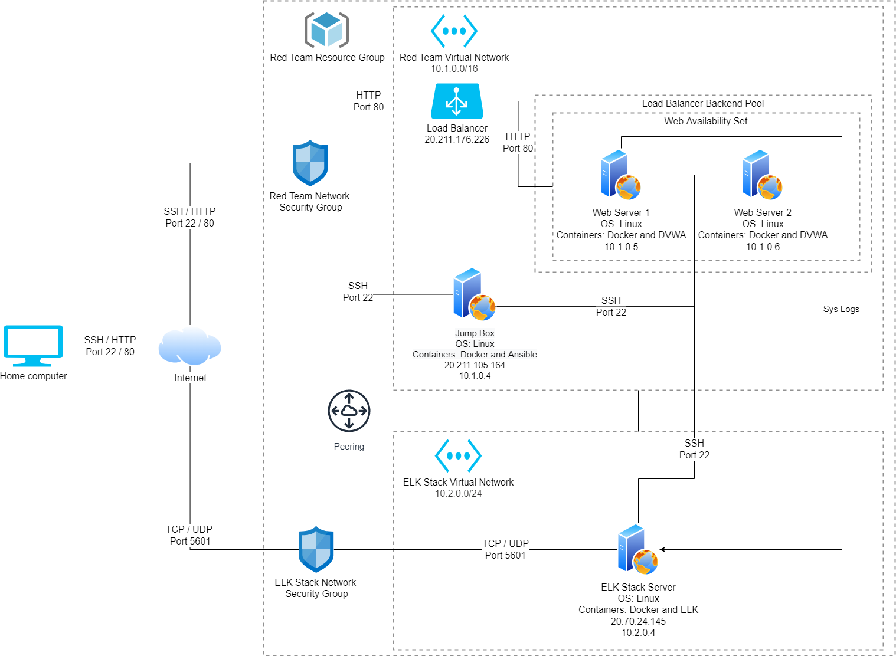

## Automated ELK Stack Deployment

The files in this repository were used to configure the network depicted below.

These files have been tested and used to generate a live ELK deployment on Azure. They can be used to either recreate the entire deployment pictured above. Alternatively, select portions of the [Ansible](https://github.com/JKorljan/Cyber-Security-Bootcamp-2021/tree/main/Project1-ELKStack/Ansible) file may be used to install only certain pieces of it.

This document contains the following details:
- Description of the Topology
- Access Policies
- ELK Configuration
  - Beats in Use
  - Machines Being Monitored
- How to Use the Ansible Build

### Description of the Topology

The main purpose of this network is to expose a load-balanced and monitored instance of DVWA, the D*mn Vulnerable Web Application.

Load balancing ensures that the application will be highly available while maintaining the workload over both web servers in addition to restricting inbound access to the network.
With two web servers implemented we ensure contigency and our security groups only allow ourselves to connect and block all other traffic. With a jump box we have a single point of connection and management of all servers and containers deployed.

Integrating an ELK server allows users to easily monitor the vulnerable VMs for changes to the files on the servers, logging the information and monitoring system resources and services.

The configuration details of each machine may be found below.

| Name     | Function          | IP Address | Operating System |
|----------|-------------------|------------|------------------|
| Jump Box | Gateway           | 10.1.0.4   | Linux            |
| DVWA 1   | Web Server        | 10.1.0.5   | Linux            |
| DVWA 2   | Web Server        | 10.1.0.6   | Linux            |
| ELK      | Monitoring Server | 10.2.0.4   | Linux            |

### Access Policies

The machines on the internal network are not exposed to the public Internet. 

Only the jump box machine can accept connections from the Internet. Access to this machine is only allowed from the following IP addresses: 20.211.105.164

Machines within the network can only be accessed by each other.
The jump box can access the ELK server, and the DVWA servers send information to it.

A summary of the access policies in place can be found in the table below.

| Name     | Publicily Accessible | Allowed IP Addresses    |
|----------|----------------------|-------------------------|
| Jump Box | Yes                  | 20.211.105.164          |
| DVWA 1   | No                   | 10.1.0.0 - 10.1.255.255 |
| DVWA 2   | No                   | 10.1.0.0 - 10.1.255.255 |
| ELK      | No                   | 10.2.0.0 - 10.2.255.255 |

### Elk Configuration

Ansible was used to automate configuration of the ELK machine. No configuration was performed manually, which is advantageous because it ensures the configurations can be deployed over mulitple machines quickly and accurately, making sure all settings are exactly the same and allows ease of installation and changes if future machines are deployed.

The playbook implements the following tasks:

- Install docker
- Install pip3
- Install docker python module
- Increase VM virtual memory
- Download and launch docker elk container
- Enable docker on boot/restart

The following screenshot displays the result of running `docker ps` after successfully configuring the ELK instance.

### Target Machines & Beats
This ELK server is configured to monitor the following machines:
- 10.1.0.5 (DVWA 1)
- 10.1.0.6 (DVWA 2)

We have installed the following Beats on these machines:
- Filebeat
- Metricbeat

These Beats allow us to collect the following information from each machine:
- Filebeat: Filebeat monitors system files and logs changes. This can be used to monitor syslogs, SSH logins, sudo commands and new user and groups.
- Metricbeat: Metricbeat monitors system resources and services. This can be used to track network in and out bytes and CPU and memory usages.

### Using the Playbook
In order to use the playbook, you will need to have an Ansible control node already configured. Assuming you have such a control node provisioned: 

SSH into the control node and follow the steps below:
- 
- Copy the [Playbook](https://github.com/JKorljan/Cyber-Security-Bootcamp-2021/blob/main/Project1-ELKStack/Ansible/Playbooks/Elk-playbook.yml) file to your ansible file
- Update the [hosts](https://github.com/JKorljan/Cyber-Security-Bootcamp-2021/tree/main/Project1-ELKStack/Ansible/hosts) file to change/add the elk servers IP addresses
- Run the playbook using command `ansible-playbook`; example `ansible-playbook Elk-playbook.yml`
- Navigate to `http://{yourIP}:5601/app/kibana/` in your web browser to check that the installation worked as expected
